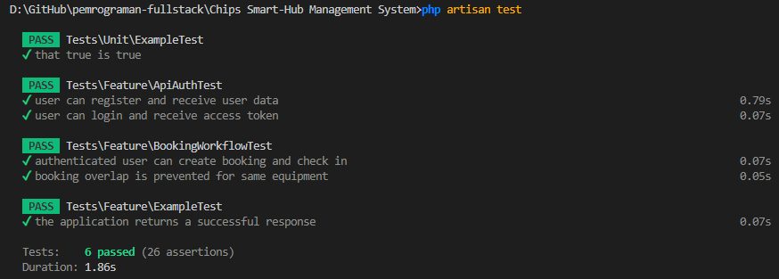

# Chips Smart-Hub Management System

A Laravel-based backend for managing room reservations, equipment inventory, and check-in status via API.

## Fitur Utama

- CRUD inventory equipment (`equipment`)
- CRUD room scheduling (`rooms`)
- CRUD peminjaman dan booking (`bookings`)
- Authentication token API untuk aplikasi tablet sederhana
- API check-in status pada peminjaman
- MySQL-ready schema dengan migration otomatis

## Setup

1. Salin file environment:

```powershell
Copy-Item .env.example .env
```

2. Ubah database connection di `.env` ke MySQL:

```env
DB_CONNECTION=mysql
DB_HOST=127.0.0.1
DB_PORT=3306
DB_DATABASE=smart_hub
DB_USERNAME=root
DB_PASSWORD=
```

> Pastikan database `smart_hub` sudah dibuat di MySQL sebelum menjalankan migrate.

3. Install dependency:

```powershell
composer install
```

4. Generate application key:

```powershell
php artisan key:generate
```

5. Jalankan migration dan seeder:

```powershell
php artisan migrate --seed
```

6. Jalankan server:

```powershell
php artisan serve
```

## Endpoint API

### Public

- `POST /api/login`
- `POST /api/register`

### Authenticated (Bearer token)

- `GET /api/me`
- `POST /api/logout`
- `GET /api/equipment`
- `POST /api/equipment`
- `GET /api/equipment/{id}`
- `PUT/PATCH /api/equipment/{id}`
- `DELETE /api/equipment/{id}`
- `GET /api/rooms`
- `POST /api/rooms`
- `GET /api/rooms/{id}`
- `PUT/PATCH /api/rooms/{id}`
- `DELETE /api/rooms/{id}`
- `GET /api/bookings`
- `POST /api/bookings`
- `GET /api/bookings/{id}`
- `PUT/PATCH /api/bookings/{id}`
- `DELETE /api/bookings/{id}`
- `POST /api/bookings/{id}/check-in`

## Branching Strategy

- Gunakan `master` hanya untuk kode stabil dan hasil akhir tugas.
- Kerjakan setiap fitur di cabang terpisah, misalnya `feature/api-auth`, `feature/equipment-crud`, `feature/booking-checkin`, atau `feature/notification-email`.
- Buat commit kecil yang fokus pada satu perubahan, lalu merge ke `master` melalui pull request atau merge request.
- Hindari bekerja langsung di `master` agar tim bisa menambahkan fitur email/notification tanpa mengganggu tugas utama.

## Database Schema

- `users`
  - `id`, `name`, `email`, `role`, `api_token`, `password`, `remember_token`, `timestamps`
  - menyimpan token API untuk autentikasi tablet.
- `equipment`
  - `id`, `code`, `name`, `category`, `quantity`, `condition`, `status`, `description`, `timestamps`
  - inventory alat dengan status dan kuantitas.
- `rooms`
  - `id`, `name`, `location`, `capacity`, `status`, `description`, `timestamps`
  - data ruang kerja/studio yang dapat dipesan.
- `bookings`
  - `id`, `user_id`, `equipment_id`, `room_id`, `start_time`, `end_time`, `purpose`, `status`, `check_in_at`, `timestamps`
  - booking dapat terkait equipment atau room, lalu dilakukan check-in untuk memperbarui status.

## API Details

- Autentikasi API menggunakan token Bearer dari `api_token`.
- Booking memvalidasi jadwal agar alat atau ruang tidak dibooking dua kali dalam periode yang sama.
- `POST /api/bookings/{id}/check-in` mengubah status booking menjadi `checked_in` dan menyimpan waktu check-in.

## Analisis Skema Database (Detail)

Dokumen ini menjelaskan alasan desain tabel utama, relasi, dan aturan validasi yang diterapkan.

- `users`
  - Kolom utama: `id`, `name`, `email`, `role`, `api_token`, `password`, `remember_token`, `timestamps`.
  - Tujuan: menyimpan akun admin dan user peminjam. `api_token` digunakan untuk autentikasi stateless dari aplikasi tablet.
  - Indeks/constraint: `email` unik, `api_token` unik (nullable).

- `equipment`
  - Kolom utama: `id`, `code`, `name`, `category`, `quantity`, `condition`, `status`, `description`, `timestamps`.
  - Tujuan: inventaris alat yang dapat dipinjam. `quantity` menyatakan stok, `status` menyatakan ketersediaan umum.
  - Constraint: `code` unik untuk referensi fisik/perangkat.

- `rooms`
  - Kolom utama: `id`, `name`, `location`, `capacity`, `status`, `description`, `timestamps`.
  - Tujuan: data ruang/ studio yang dapat dipesan.

- `bookings`
  - Kolom utama: `id`, `user_id`, `equipment_id`, `room_id`, `start_time`, `end_time`, `purpose`, `status`, `check_in_at`, `timestamps`.
  - Tujuan: menyimpan peminjaman/booking yang dapat terkait `equipment` atau `room` (atau keduanya jika perlu).
  - Relasi: `user_id` -> `users.id` (cascade on delete), `equipment_id` -> `equipment.id` (nullable), `room_id` -> `rooms.id` (nullable).
  - Aturan bisnis penting:
    - Hanya salah satu dari `equipment_id` atau `room_id` yang wajib pada pembuatan (required_without).
    - Status booking: `pending`, `approved`, `checked_in`, `completed`, `cancelled`.
    - Prevent double-booking: cek overlap waktu pada `equipment_id` atau `room_id` untuk status aktif (`pending`, `approved`, `checked_in`).

Desain ini memudahkan:
- auditing (timestamps),
- validasi stok equipment (quantity),
- hubungan user-booking untuk menampilkan riwayat peminjaman.

Rekomendasi tambahan untuk produksi:
- Tambahkan index pada `start_time`, `end_time`, `equipment_id`, dan `room_id` jika volume booking besar.
- Pertimbangkan tabel `notifications` atau queue untuk notifikasi email/real-time.

## Detail Endpoint API (Request / Response / Validasi)

Semua endpoint yang dilindungi memerlukan header:

```
Authorization: Bearer {api_token}
```

1) Autentikasi
- POST `/api/register`
  - Body: `{ "name": "...", "email": "...", "password": "..." }`
  - Response (201): `{ "user": { "id", "name", "email", "role" }, "message": "Registrasi berhasil..." }`

- POST `/api/login`
  - Body: `{ "email": "...", "password": "..." }`
  - Response (200):
    ```json
    {
      "access_token": "<token>",
      "token_type": "Bearer",
      "user": { "id", "name", "email", "role" }
    }
    ```

2) Authenticated user
- GET `/api/me` — mereturn data user saat ini (200)
- POST `/api/logout` — menghapus `api_token` dan mengakhiri sesi (200)

3) Equipment (CRUD)
- GET `/api/equipment` — daftar semua equipment (200)
- POST `/api/equipment` — buat equipment baru
  - Validasi contoh: `code` (required, unique), `name`, `quantity` (integer >= 0)
  - Response: 201 Created dengan objek equipment
- GET `/api/equipment/{id}` — detail equipment (200)
- PUT/PATCH `/api/equipment/{id}` — update (200)
- DELETE `/api/equipment/{id}` — hapus (200, pesan konfirmasi)

4) Rooms (CRUD)
- GET `/api/rooms`
- POST `/api/rooms` — buat room baru (`name`, `capacity`)
- GET `/api/rooms/{id}`
- PUT/PATCH `/api/rooms/{id}`
- DELETE `/api/rooms/{id}`

5) Bookings (peminjaman)
- GET `/api/bookings` — daftar booking (200)
  - Mendukung query param `?status=pending|approved|checked_in|completed|cancelled`
- POST `/api/bookings` — buat booking baru
  - Body contoh:
    ```json
    {
      "equipment_id": 1,
      "room_id": null,
      "start_time": "2026-05-20 10:00:00",
      "end_time": "2026-05-20 12:00:00",
      "purpose": "Meeting"
    }
    ```
  - Validasi utama:
    - `start_time` harus >= now
    - `end_time` > `start_time`
    - tidak boleh terjadi overlap untuk `equipment_id` atau `room_id` pada status aktif
  - Response: 201 Created dengan objek booking

- GET `/api/bookings/{id}` — detail booking (200)
- PUT/PATCH `/api/bookings/{id}` — update booking (200)
  - Validasi update juga memeriksa konflik waktu jika mengubah jadwal atau resource
- DELETE `/api/bookings/{id}` — hapus booking (200)

- POST `/api/bookings/{id}/check-in` — menandai check-in
  - Behavior:
    - Jika booking sudah `checked_in` -> 422
    - Jika booking `cancelled` atau `completed` -> 422
    - Sukses: ubah `status` menjadi `checked_in`, set `check_in_at` ke waktu server (200)

## Contoh penggunaan singkat (curl)

Login dan gunakan token:

```bash
curl -X POST https://example.com/api/login \
  -H "Content-Type: application/json" \
  -d '{"email":"user@example.com","password":"secret"}'
```

Kemudian panggil endpoint terlindungi:

```bash
curl -H "Authorization: Bearer <ACCESS_TOKEN>" https://example.com/api/equipment
```

## Catatan terakhir

- Dokumen ini melengkapi dokumentasi teknis untuk mempermudah pengembangan fitur selanjutnya (mis. notifikasi email, integrasi real-time).
- Jika ingin, saya bisa menambahkan contoh Postman collection atau OpenAPI spec untuk dokumentasi API lebih formal.


## Hasil Test
